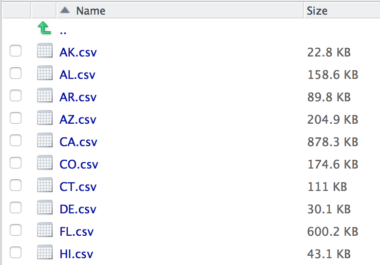

Creating a single data frame from a folder of similarly structure CSV spreadsheets.

## Description

Like Voltron-ing your data

## Usage

bulk_csv(folder = "DEFAULTBULKCSV2017",
  export = "filenamedefaultbulkcsv2017.csv")

## Arguments

* `folder` - The folder in relation to your working directory where the csv files exist. Default folder is the current working directory.
* `export` - File name to export csv file as, if wanted.

## Note

This package is based on [**readr**](https://blog.rstudio.org/2015/04/09/readr-0-1-0/), so passing on variables from `read_csv` will work in `bulk_csv`. These variables will apply to the import of each CSV sheet.


### Documentation

In this example, these CSVs reside in a folder called **state_data**.

```{r setup, include=FALSE}
knitr::opts_chunk$set(echo = FALSE, message = FALSE)
```

<div style="max-width:400px">
<center></center></div>

----

The data structure **must** be similar for each data set, as in column names and data types within the columns are consistent.

Or the bulk join will not work.

To create a new dataframe with all the data sets combined, the command would be:

`combined_data <- bulk_csv(folder="state_data")`

To simply export the data as a new combined CSV file, the command would be:

`bulk_csv(folder="state_data", export="combined_data.csv")`

This would save the file to the current working directory.

You can specify the location to download in `export` as long as you put the folder structure before the CSV file name, like:

`bulk_csv(folder="state_data", export="data_export/combined_data.csv")`

