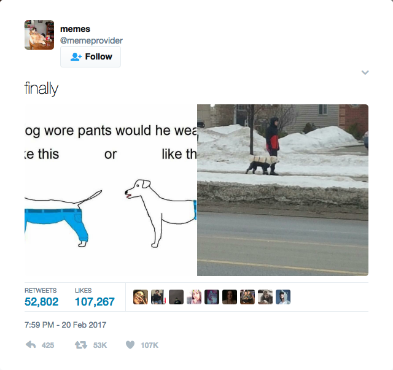
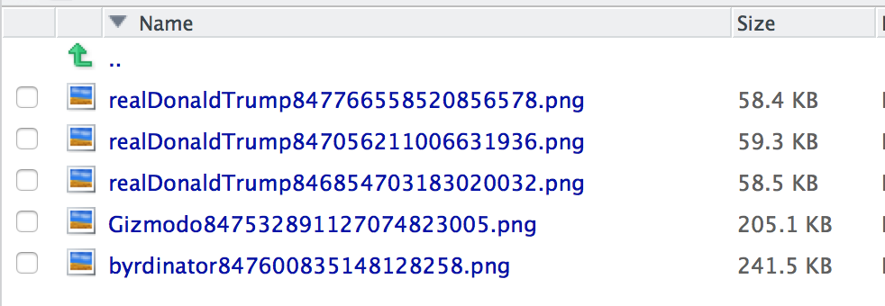

Generate a screenshot of a tweet

## Description

Quick screenshot of a tweet based on a link or array of links.
  
## Usage

tweet_cap(link = "", filename = "NOTHINGTWEET_CAP", folder = "DEFAULTTWEETCAP")

## Arguments


* `link` - the URL of the tweet
* `filename` -the base name of the image you want to save. Default will be user's twitter handle.
* `folder` - the folder you want to save the screenshot to. If ignored, the folder will be the working directory.

### Documentation

#### Single tweet

To grat one tweet, just put in the URL address.

`tweet_cap(link="https://twitter.com/memeprovider/status/833888807959289856", folder="images")`

This image will be generated to the **images** folder.

<div style="max-width:500px">
<center></center></div>

----

#### Multiple tweets

If you had a data frame of links:

```{r tweets_list, warning=F, message=F}
library(tidyverse)
library(knitr)
```

```{r loading_data}
tweets <- tribble(
                                                            ~Link,          ~Account,
  "https://twitter.com/realDonaldTrump/status/847766558520856578", "realDonaldTrump",
  "https://twitter.com/realDonaldTrump/status/847056211006631936", "realDonaldTrump",
  "https://twitter.com/realDonaldTrump/status/846854703183020032", "realDonaldTrump",
       "https://twitter.com/byrdinator/status/847600835148128258",      "byrdinator",
          "https://twitter.com/Gizmodo/status/847532891127074823",         "Gizmodo"
  )

kable(tweets)
```

To generate a folder of images of the list of tweets, use:

```{r, eval=F}
tweet_cap(tweets$Link, folder="images")
```

And you'll get: 

<div style="max-width:500px">
<center></center></div>
